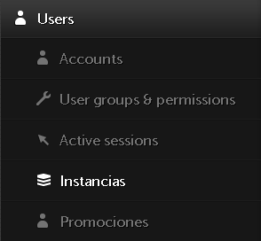
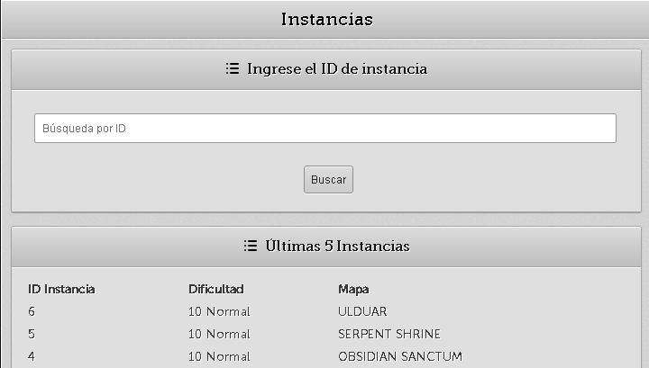
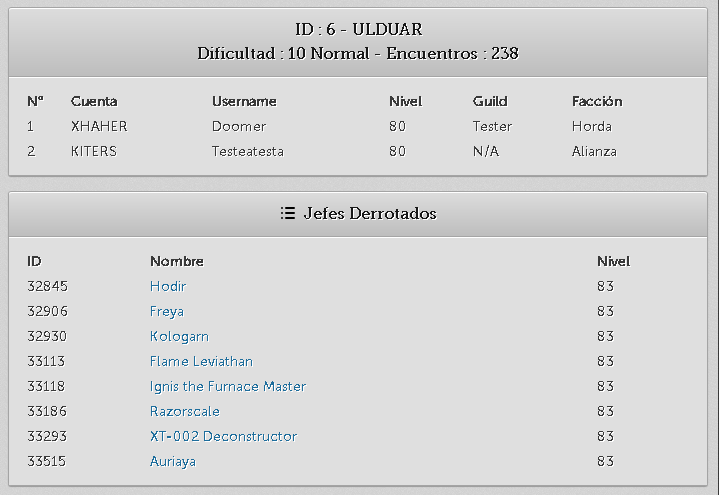
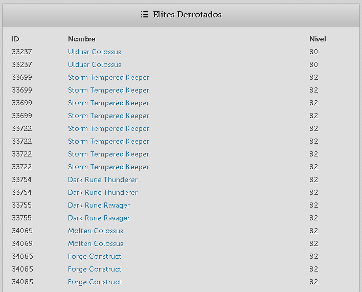

# InstanceView
 
 Módulo para FusionCMS el cual permite revisar integrantes, instancia y npc derrotados dentro de una raid.
 
## Módulo de FusionCMS

* Configurable string de errores básicos.

> config\instance_config.php

```
$config['cta_language'] = array(

    'ERROR_REALM'      => 'El reino seleccionado es inválido o no existe.',
    'ERROR_WEB_FAIL'  => 'Error interno.',
    'ERROR_ID'  => 'El ID de la raid no existe.',
);
```






## Requisitos

* 6.1.7+ [FusionCMS](https://github.com/poszer/FusionCMS)

## Instalación 

```
1) Usar el comando `git clone` o descargarlo manualmente.
3) Mover el contenido en la carpeta carpeta raíz de FusionCMS en /modules.
3) Disfrutar!
```

## Creditos 

* [GermanMakuc](https://github.com/GermanMakuc) (Autor del módulo)
* [FusionCMS](https://github.com/poszer/FusionCMS)
